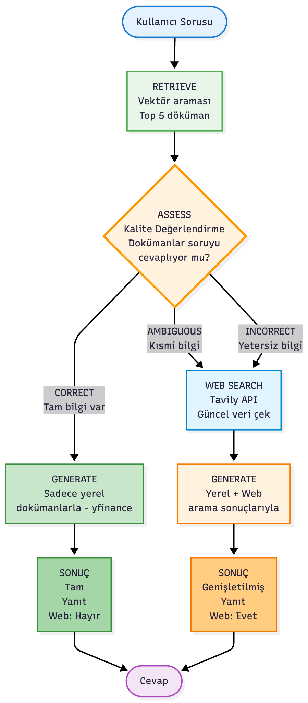
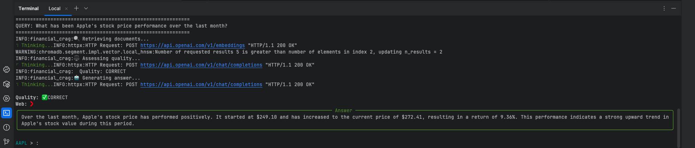
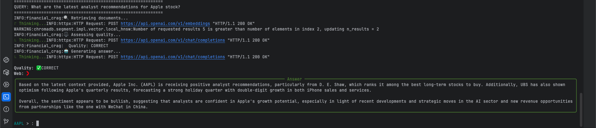
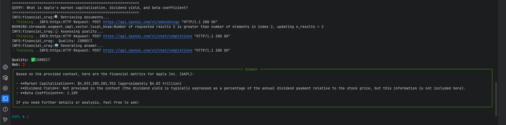
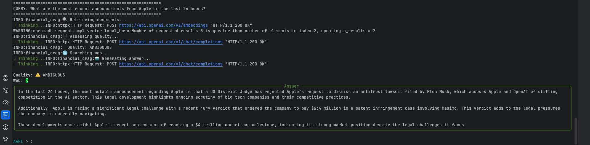
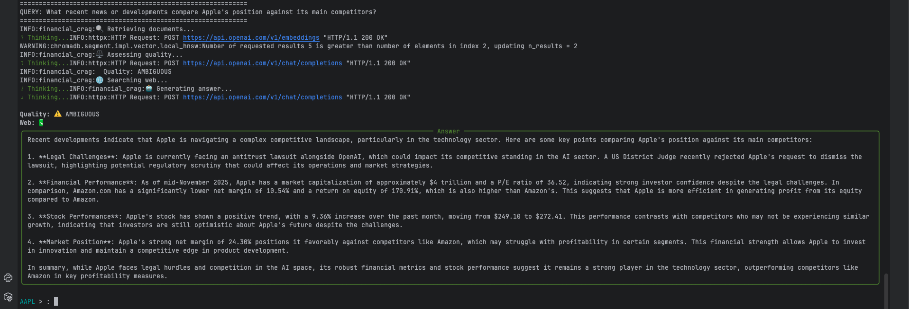

# Finansal Veriler için CRAG Tabanlı Soru-Cevap Sistemi

Bir önceki yazımda bahsettiğim CRAG (Corrective Retrieval-Augmented Generation) mimarisi [https://medium.com/@k.ulgen90/corrective-retrieval-augmented-generation-crag-mimarisi-3b78da89f84b], özellikle hatalı veya eksik geri getirme süreçlerinde RAG tabanlı sistemlerin nasıl zorlandığını göstermesi açısından önemli bir yaklaşım. RAG modellerinde retrieval aşaması hatalı olduğunda, llm yanlış veya yanıltıcı bilgilerle beslendiği için halüsinasyon üretme riski ciddi şekilde artıyor. CRAG ise bu sorunu, RAG’ın üzerine düzeltici bir katman ekleyerek çözüyor.

CRAG’in merkezinde retrieval evaluator bulunuyor. Bu bileşen, getirilen belgeleri analiz ederek üç karardan birini veriyor:
- correct: Belgeler soruyu doğrudan yanıtlıyor
- ambiguous: Kısmi bilgi var, destek gerekebilir
- incorrect: Belgeler yetersiz veya alakasız


Bu projede, hisse senedi verileri için çalışan basit bir CRAG uygulaması geliştirdim. Amaç, finansal analizlerde kullanılabilecek, halüsinasyon riskini azaltan, gerektiğinde düzeltici adımlar uygulayabilen bir soru-cevap sistemi oluşturmak.

Yapı iki ana dosyadan oluşuyor:
- financial_crag.py → Sistemin çekirdeği (veri toplama + CRAG iş akışı)
- financial_crag_cli.py → Terminal üzerinden kullanılabilir CLI arayüzü

---

## Genel Bakış

Sistem şu akışı takip ediyor:

1. **setup TICKER** komutu ile hisse verileri toplanır (**setup AAPL**)
2. Toplanan veriler embed edilip Chroma veritabanına eklenir
3. Kullanıcı bir soru sorduğunda vektör araması yapılır
4. Bulunan dokümanların yeterliliği değerlendirilir
5. Dokümanlar soru için yeterli değilse sistem otomatik olarak web araması yapar
6. Elde edilen bilgiler birleştirilir ve LLM’den yanıt üretilir

Bu yapı özellikle finansal sorularda halüsinasyon riskini azaltmak için tasarlanmıştır.


## Veri Toplama

Veri katmanının yönetimi `DataExtractor` sınıfında bulunuyor. Burada iki ana kaynak kullanılıyor:

* **yfinance** → Hisselerin finansal metrikleri, temel bilgiler, 1 aylık performans
* **NewsAPI** → Son günlerdeki haber başlıkları ve açıklamalar

## Vektör Veritabanı

Veriler toplandıktan sonra OpenAI’ın görece hafif embedding modeli (text-embedding-3-small) ile embed ediliyor ve Chroma içinde saklanıyor.

Bu aşama, soruların anlamsal olarak doğru içeriklerle eşleşmesini sağlıyor.

## Kalite Değerlendirmesi

CRAG sisteminin en önemli kısmı, “bulunan dokümanlar soruyu gerçekten yanıtlıyor mu?” sorusuna verilen cevaptır.

Bunu `CRAGAssessor` sınıfı üstleniyor.
Sistem dokümanları üç durumdan biriyle etiketliyor:
* **correct** → Dokümanlar soruyu yanıtlıyor
* **ambiguous** → Kısmen yanıtlıyor, destek gerekebilir
* **incorrect** → Dokümanlar uygun değil

## Web Araması

Eğer dokümanlar yetersizse sistem web aramasına geçiyor.
Burada **Tavily** API kullanılıyor. Soru ve hisse koduna göre kısa içerikler alınıyor ve context’e ekleniyor.

Bu sayede sistem, gerektiğinde en güncel bilgileri de yanıtın içine katabiliyor.


## Cevap Üretimi

Context hazırlandıktan sonra LLM’e gönderiliyor ve modelden son yanıt alınıyor.
Kalite etiketi “correct” ise yalnızca lokal veriler kullanılır; diğer durumlarda lokal + web içerikleri birleştirilerek daha kapsamlı bir context oluşturulur.

---

## Kullanım

### 1. Gerekli API anahtarlarını tanımlayın (`.env` dosyası oluşturun)

```
export OPENAI_API_KEY=""
export NEWSAPI_API_KEY=""
export TAVILY_API_KEY=""
```

### 2. Çalıştırın

```
python financial_crag_cli.py
```

### 3. Örnek

```
CRAG > setup AAPL
CRAG > What is the P/E ratio?
```
---

## CRAG Pipeline

<div align="center">
  
</div>

---

## Örnek Çıktı

- Örnek-1
<div align="center">
  
</div>

- Örnek-2

<div align="center">
  
</div>

- Örnek-3

<div align="center">
  
</div>

- Örnek-4

<div align="center">
  
</div>

- Örnek-5

<div align="center">
  
</div>
